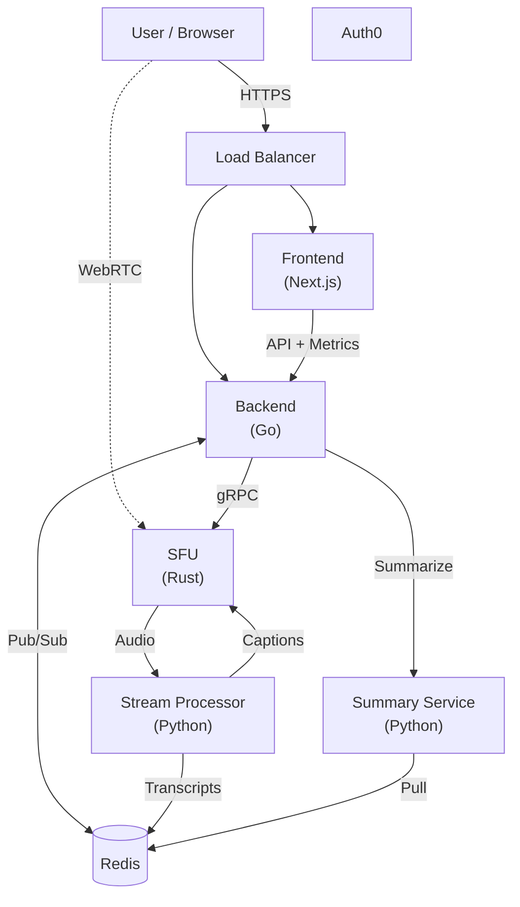

# Video Conferencing (Distributed SFU)

**A high-performance, distributed video conferencing platform.**

This project implements a "Split-Brain" SFU architecture that decouples signaling (Go) from media routing (Rust), allowing for massive scalability and optimal performance.

[](https://opensource.org/licenses/MIT)

---

## 🏗 System Architecture




### 1. Frontend Service
- **Stack:** Next.js 16, React 19, Zustand, Tailwind CSS.
- **Role:** Handles UI, local state, and WebRTC negotiation. Connects to the Backend via WebSocket for signaling and directly to the SFU via WebRTC for media transport.

### 2. Backend Service (The "Control Plane")
- **Stack:** Go (Golang), Gin, Gorilla WebSocket.
- **Key Features:**
    - **Signaling:** Relaying SDP/ICE messages between clients and the SFU.
    - **Room State:** Managing participants, permissions, and chat.
    - **Orchestration:** Instructing the SFU (via **gRPC**) to allocate resources.
    - **Scaling:** Uses **Redis Pub/Sub** to synchronize state across multiple backend instances.
    - **Reliability:** Implements **Circuit Breakers** (Gobreaker) and **Rate Limiting** (Ulule) for robust fault tolerance.
    - **Observability:** **Structured Logging** (JSON) with correlation IDs for request tracing.

### 3. SFU Service (The "Data Plane")
- **Stack:** Rust, Tokio, Tonic (gRPC), Webrtc.rs.
- **Role:** The "Muscle". A Selective Forwarding Unit that:
    - **Ingests** media streams via UDP/TCP.
    - **Fan-outs** streams to subscribers with zero-copy forwarding.
    - **Terminates** DTLS/SRTP encryption.
    - **Optimized** for high throughput and low latency (no GC pauses).

### 4. Stream Processor (ML Service)
- **Path:** `backend/python/stream-processor`
- **Stack:** Python, **FastAPI**, **gRPC**, **Faster-Whisper**, **uv**.
- **Role:** Real-time Audio ML (Captioning, Translation, Sentiment).
    - **Receives** raw audio chunks from the SFU via gRPC.
    - **Transcribes** audio using OpenAI's Whisper model (optimized).
    - **Streams** captions back to the SFU for broadcast.
    - **Pushes** finalized transcripts to Redis for summarization.

### 5. Summary Service (GenAI)
- **Path:** `backend/python/summary-service`
- **Stack:** Python, **FastAPI**, **Redis**, **Local LLM (Llama 3.2 3B via llama-cpp-python)**.
- **Role:** Post-meeting Intelligence.
    - **Triggered** via **gRPC** by the Go Backend.
    - **Retrieves** full conversation transcripts from Redis.
    - **Generates** summaries and action items using LLMs.

---

## 🔄 Key Workflows

### Join Room Flow
1. **Client** connects to **Backend** (WebSocket).
2. **Backend** authenticates user and creates a **Room**.
3. **Backend** calls **SFU** (gRPC) to create a session for the user.
4. **Backend** signals **Client** to start WebRTC negotiation.
5. **Client** & **SFU** exchange SDP Offer/Answer via Backend.
6. **Client** & **SFU** establish direct P2P WebRTC connection.

---

## Deployment & Infrastructure

The project supports two deployment models depending on your needs.

### 1. Simple Deployment (Resume / Demo)
A simplified, single-node deployment using Docker Compose and Caddy. Perfect for a quick start or resume demonstration.
- **Path:** [`devops/simple`](devops/simple/README.md)
- **Features:** Auto-HTTPS, single command deploy, lightweight.

### 2. Enterprise Deployment (Scalable)
The full cloud-native setup for production environments.
- **Path:** `devops/kubernetes` & `devops/terraform`
- **Infrastructure:** AWS (EKS, ElastiCache, VPC) managed via **Terraform**.
- **Orchestration:** **Kubernetes** with **ArgoCD** for GitOps/Continuous Delivery.
- **Security:** **External Secrets Operator** for secret management.

---

## 🛠 Development Setup

### Prerequisites
- Docker & Docker Compose
- Go 1.22+
- Node.js 20+
- Rust (latest stable)
- Python 3.12+ & `uv` (for Stream Processor & Summary Service)

### Quick Start
1. **Copy Environment Variables:**
   ```bash
   cp devops/.env.example .env
   ```
2. **Generate Secrets:**
   ```bash
   echo "JWT_SECRET=$(openssl rand -base64 32)" >> .env
   ```
3. **Start the Stack:**
   ```bash
   docker-compose up --build
   ```
4. **Generate Protobufs:**
   If you modify `.proto` files, regenerate the code:
   ```bash
   ./scripts/generate_protos.sh
   ```
