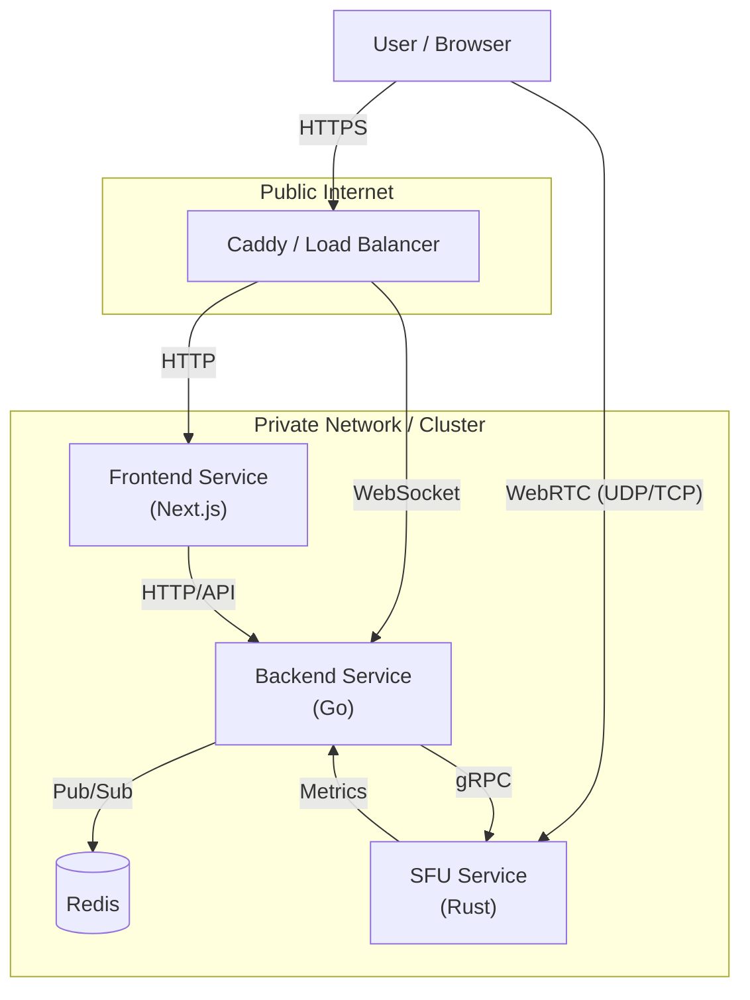

# Video Conferencing (Distributed SFU)

**A high-performance, distributed video conferencing platform.**

This project implements a "Split-Brain" SFU architecture that decouples signaling (Go) from media routing (Rust), allowing for massive scalability and optimal performance.

[](https://opensource.org/licenses/MIT)

---

## 🏗 System Architecture

The platform consists of three primary services working in concert:



### 1. Frontend Service
- **Stack:** Next.js 16, React 19, Zustand, Tailwind CSS.
- **Role:** Handles UI, local state, and WebRTC negotiation. Connects to the Backend via WebSocket for signaling and directly to the SFU via WebRTC for media transport.

### 2. Backend Service (The "Control Plane")
- **Stack:** Go (Golang), Gin, Gorilla WebSocket.
- **Role:** The "Brain" of the operation. It manages:
    - **Signaling:** Relaying SDP/ICE messages between clients and the SFU.
    - **Room State:** Managing participants, permissions, and chat.
    - **Orchestration:** Instructing the SFU (via **gRPC**) to allocate resources.
    - **Scaling:** Uses **Redis Pub/Sub** to synchronize state across multiple backend instances.

### 3. SFU Service (The "Data Plane")
- **Stack:** Rust, Tokio, Tonic (gRPC), Webrtc.rs.
- **Role:** The "Muscle". A Selective Forwarding Unit that:
    - **Ingests** media streams via UDP/TCP.
    - **Fan-outs** streams to subscribers with zero-copy forwarding.
    - **Terminates** DTLS/SRTP encryption.
    - **Optimized** for high throughput and low latency (no GC pauses).

---

## 🔄 Key Workflows

### Join Room Flow
1. **Client** connects to **Backend** (WebSocket).
2. **Backend** authenticates user and creates a **Room**.
3. **Backend** calls **SFU** (gRPC) to create a session for the user.
4. **Backend** signals **Client** to start WebRTC negotiation.
5. **Client** & **SFU** exchange SDP Offer/Answer via Backend.
6. **Client** & **SFU** establish direct P2P WebRTC connection.

---

## 🛠 Tech Stack & Infrastructure

- **Protocol:** Protocol Buffers (gRPC) for internal service-to-service communication.
- **Data Store:** Redis (for signaling bus and ephemeral state).
- **Reverse Proxy:** Caddy (Automatic HTTPS, Load Balancing).
- **Containerization:** Docker & Docker Compose.
- **Observability:** Prometheus & Grafana (Packet loss, jitter, memory/CPU metrics).

---

## 🚀 Environment Configuration

The application requires specific environment variables to be set.

### Required Variables

**Go Backend:**
- `JWT_SECRET`: Secret for token signing (min 32 chars).
- `PORT`: Server port (e.g., `8080`).
- `RUST_SFU_ADDR`: Address of the Rust SFU (e.g., `localhost:50051`).
- `REDIS_ADDR`: Address of Redis (e.g., `redis:6379`).

**Rust SFU:**
- `GRPC_PORT`: gRPC listening port (e.g., `50051`).

**Frontend:**
- `NEXT_PUBLIC_WS_URL`: WebSocket URL (e.g., `wss://api.example.com`).

### Quick Setup

1. Copy the example env file:
   ```bash
   cp devops/.env.example .env
   ```

2. Generate a secure secret:
   ```bash
   echo "JWT_SECRET=$(openssl rand -base64 32)" >> .env
   ```

3. Start the stack:
   ```bash
   docker-compose up --build
   ```

4. **Generate Protobufs** (if developing):
   ```bash
   ./scripts/generate_protos.sh
   ```
